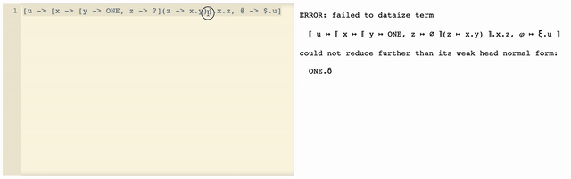

Try [𝜑-calculus](https://www.eolang.org) online: [click here](https://polystat.github.io/try-phi/).



Try out these live examples:

1. [Factorial](https://polystat.github.io/try-phi/?snippet=%5B+factorial+-%3E%0A++%5B+n+-%3E+%3F%0A++%2C+%40+-%3E+n.less%28_1+-%3E+2%29.if%28_1+-%3E+1%29%28_2+-%3E%0A++++++n.mul%28_1+-%3E+factorial%28n+-%3E+n.sub%28_1+-%3E+1%29%29%29%0A++++%29%0A++%5D%0A%5D.factorial%28n+-%3E+10%29)
2. [Factorial with user-defined fixpoint combinator](https://polystat.github.io/try-phi/?snippet=%5B+fix+-%3E%0A++%5B+f+-%3E+%3F%0A++%2C+%40+-%3E+f%28x+-%3E+fix%28f+-%3E+f%29%29%0A++%5D%0A%5D.fix%28f+-%3E+%5Bx+-%3E+%3F%2C+n+-%3E+%3F%2C%0A++%40+-%3E+n.less%28_1+-%3E+2%29.if%28_1+-%3E+1%29%28%0A++++_2+-%3E+n.mul%28_1+-%3E+x%28n+-%3E+n.sub%28_1+-%3E+1%29%29%29%0A++%29%0A%5D%29%28n+-%3E+5%29)
3. [Fibonacci numbers](https://polystat.github.io/try-phi/?snippet=%5B+fib+-%3E%0A++%5B+n+-%3E+%3F%0A++%2C+%40+-%3E+n.less%28_1+-%3E+2%29.if%28%0A++++++_1+-%3E+n%0A++++%29%28%0A++++++_2+-%3E+fib%28n+-%3E+n.sub%28_1+-%3E+1%29%29.add%28_1+-%3E+fib%28n+-%3E+n.sub%28_1+-%3E+2%29%29%29%0A++++%29%0A++%5D%0A%5D.fib%28n+-%3E+7%29)

This is an experimental interpreter for a variant of 𝜑-calculus.
Right now we implement it as a term rewriting system with the following features (see [formal rules](images/untyped-calculus-rules.png)):

1. We support the following syntax:

    1. Objects: `[x -> y, y -> [z -> ?]]` (here `?` stands for free attribute marker `ø`)
    2. Attributes: `[y -> x].y.z`
    3. Single named application: `[x -> ?, @ -> x](x -> y)` (`@` stand for 𝜑 attribute)

2. By default, the interpreter will try to immediately parse and dataize an expression written in the editor.

3. If dataization fails, it will nevertheless show original term and its weak head normal form (after last reduction step).

4. At the moment, infinite recursion can hang the page and editor, — simply reload the page!

## How to contribute

This project is powered by [Elm language](https://elm-lang.org).
To develop locally, install Elm, clone this repository:

```sh
$ git clone git@github.com:polystat/try-phi.git
```

Then go into the cloned repository and build the project:

```sh
$ cd try-phi
$ elm make src/Main.elm --output=src/Main.js
```

Now run Elm reactor:

```
$ elm reactor
```

You should see a message like this one:

```
Go to http://localhost:8000 to see your project dashboard.
```

You can then go there to `src > index.html`.
Or just go to http://localhost:8000/src/index.html

Whenever you modify the code, rebuild the JS file:

```sh
$ elm make src/Main.elm --output=src/Main.js
```

And reload the page :)

Alternatively, [install](https://github.com/wking-io/elm-live) and run elm-live

```sh

```

If you want to see documentation, install [elm-doc-preview](https://github.com/dmy/elm-doc-preview)

In terminal, type `edp`
